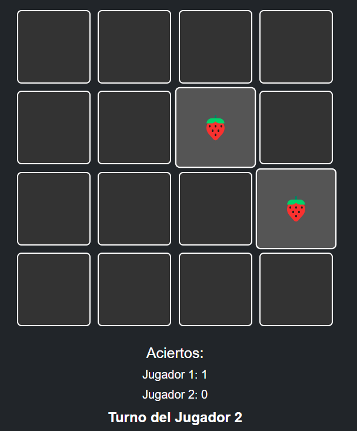

# Memotest: Juego de Memoria 🎮

¡Bienvenido al **Memotest**! Un clásico juego de memoria donde debes encontrar pares de cartas iguales. Desarrollado con **HTML**, **CSS** y **JavaScript**, y diseñado con **Bootstrap** para un estilo moderno y responsivo.

---

## 🚀 **Cómo jugar**
1. **Voltea dos cartas** para intentar encontrar su par.
2. Si las cartas coinciden, **ganas un punto**.
3. Si no coinciden, las cartas se voltean de nuevo.
4. ¡El jugador con **más aciertos** al final gana!

---

## 🖥️ **Capturas de pantalla**

---

## 🛠️ **Tecnologías utilizadas**
- **HTML5**: Estructura del juego.
- **CSS3**: Estilos y diseño visual.
- **JavaScript**: Lógica del juego.
- **Bootstrap**: Diseño responsivo.
- **Font Awesome**: Iconos para las tecnologías.

---
